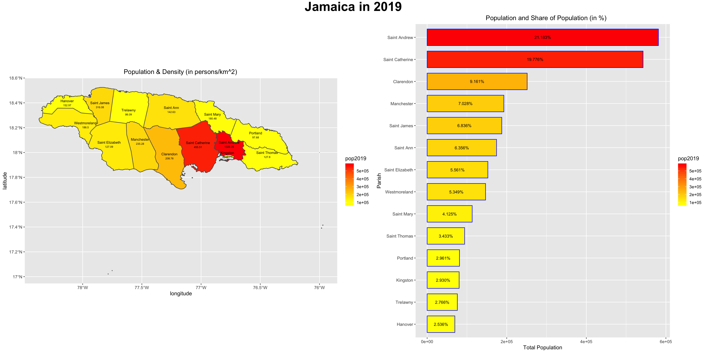
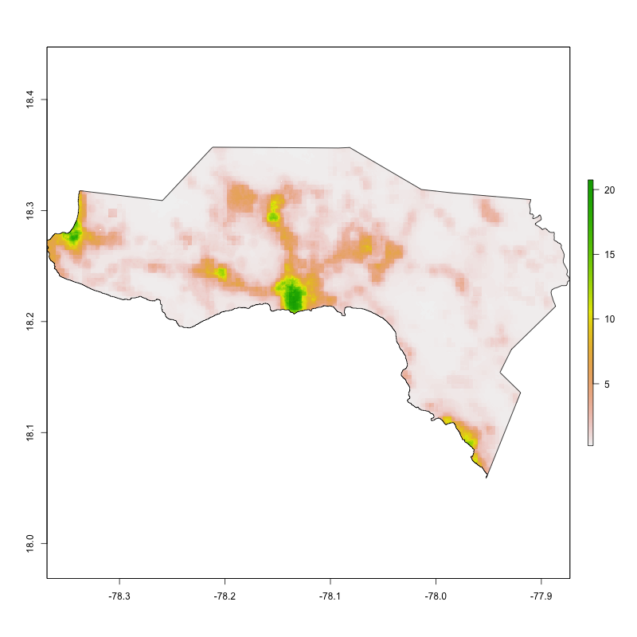
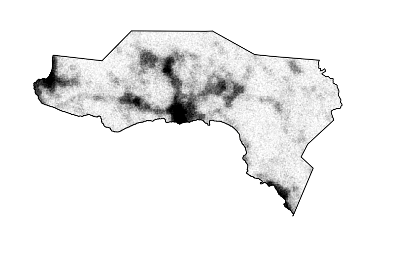
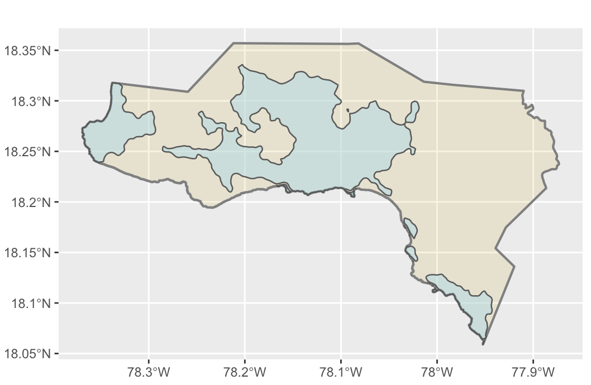
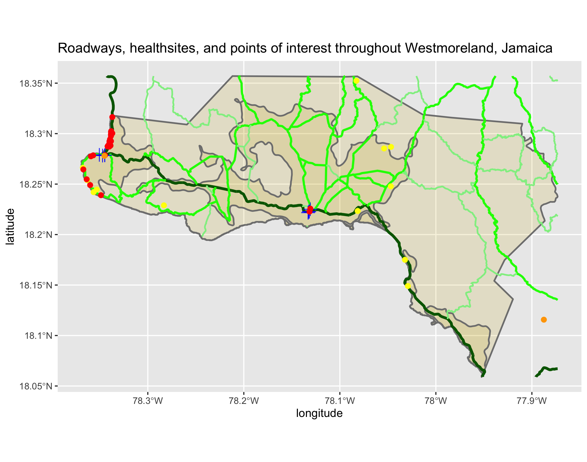
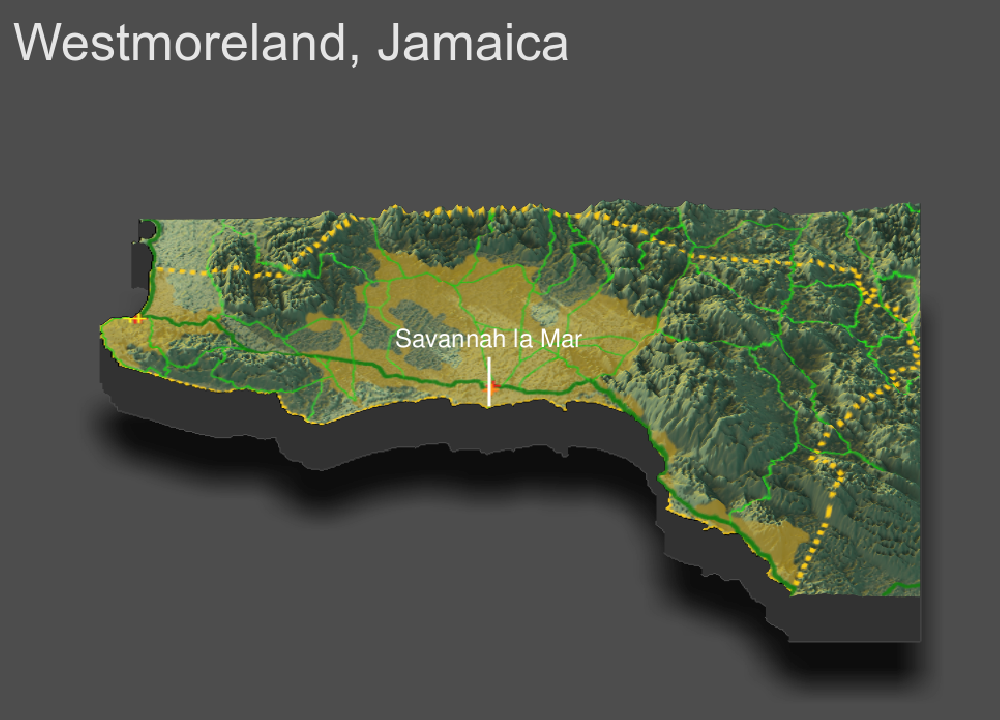

# Final Individual Deliverable - Jamaica

Henry Buron

May 13, 2020

## Administrative Subdivisions of Jamaica

Jamaica has a total population of approximately 2.9 million people. It is divided up into 14 Parishes, each ranging in population from about 60,000 to over 500,000 people. Jamaica's capital is Kingston. In addition, in the above plot, the red crosses indicate a health care facility. As you will in the following plots, the location and density of the health care facilities has a high correlation with population.

## Population of Jamaica's Parishes

## Population Distribution in Jamaica - adm1

Above is a histogram representing population distribution of Jamaica's 14 Parishes (adm2).

Above is residual model with regression line and confidence interval representing the correlation of all variables with Jamaica's population distribution. The points each represent one of Jamaica's parishes. In addition, the points on the left, which are close to the line of best fit, likely represent the more rural Parishes. The two on the right and the one below the confidence interval likely represent the more urban Parishes. It seems that urban areas with high population counts and density are harder to accurately predict. This makes sense if you consider the types of buildings within a city - such as apartments - and realize how the structure of these makes them harder to estimate.

The above plot shows the difference (error) of predicted value from the worldpop raster in Jamaica. The error appears to be relatively consistent - slightly above 0 (overestimation) - throughout most of Jamiaca, though in the Saint Catherine/Saint Andrew/ Kingston area, the error dips down to -30. This represents a large underestimation, which makes sense because this is the most highly and densly populated area of Jamaica.

## Population Distribution in Saint Catherine, Jamaica - adm2

The above plot shows the difference (error) of predicted values from the worldpop raster in the Jamaican provice Saint Catherine. The areas of overestimation appear in spots towards the south east and south west, which makes sense as that is where the largest cities are located.

This plot shows the actual population values of Saint Catherine from the worldpop site. If you compare this plot to the previous one, you will see that the areas of high population are more likely to be underestimated, and the areas of low population are more likely to be overestimated.

This 3D plot represents the variation exhibited in the predicted values. The highest error is exhibited in the more urban areas.

This mapview plot also reprsents the error of the predicted values compared to the worldpop raster. The model overpredicted in areas of high population and under predicted in areas of low population. It's interesting to note that the underprediction error seems to generally be much larger than the overprediction error.

## Description of Human Settlements, Urban Areas, Transportation Facilities, Roadways, and Density Indicators and in Westmoreland, Jamaica - adm2

The above plot represents the population per grid cell in Westmoreland, Jamaica. Westmoreland's total population is just under 145,000 people.

On this plot, each person in Westmoreland has been estimated and probalistically distributed. This means that there are just under 145,000 points.

This plot shows Westmoreland's urban areas in blue.

I was not able to generate the populatino/density points. So, I found and downloaded more data from HDX that I believe is correlated with high population density. For example, on this plot, you will see three colors of points - yellow, orange, and red. Yellow represents a tourist attraction, orange is a place of worship, and red is a restaurant. These are all things likely placed in areas with a relatively high density of people. I believe this is supported by the plot - almost all of the points are located alongside a primary road, and many of those that are not are along the coast - an area of high traffic.

From this plot, we can see that the most highly populated and dense areas of Westemoreland seem to be slightly below the middle of the plot and on the western border. It is no coincidence that the main roads go directly through these areas. In addition, this makes sense as the center is the capital, Savannah la mar, and on the west is Nigel Point, Westmoreland's most popular tourist destination. It is also worth noting that the entire sourthern and western border is coastline, likely filled with beaches and tourist attractions that draw many people.

## Topography in Westmoreland, Jamaica - adm2

This is a three-dimensional topographic plot that describes urban areas, roadways, and health care facilities in Westmoreland, Jamaica's westernmost parish. The dashed yellow line represents the parish borders, the gold shaded areas are the urban areas, the green lines represent primary, secondary, and tertiary roads, and the red, orange, and yellow crosses represent pharmacies, clinics, and dentists, respectively.

Topography has had a very large impact on the location and development of the urban areas. Much of Westmoreland is mountainous, yet the urban areas are almost each completely in the flatter regions. This is likely due to the simple fact that it is easier to build when not on the side of a mountain. There are three main urban areas in Westmoreland, and it is interesting to note that the only one that has a relatively large portion of mountainous area, is also the least developed one (the urban area on the bottom right). It is possible, and entirely probable, that it has a harder time attracting and keeping residents when they could easily move and live in a flatter region.

Although the roads seem to cover almost the entirety of Westmoreland, I still believe topography has played a big role in their development. For example, notice that primary roads are represented by dark green, secondary by green, and tertiary by light green. The primary road is completely in the flatter area, the secondary roads are mostly in the flatter area, but the tertiary roads freely extend throughout the mountainous region. The flatter areas correspond to the urban areas, which means that they are likely much more travelled and have therefore been developed to a much greater extent. It does not make much sense to develop the roads circling around the mountains that are infrequently used.

By design, health care facilities are made and located with the intent of helping the highest number of people possible. So, because the urban areas in Westmoreland are located in the flatter regions of the parish, so are the health care facilities.

In conclusion, I believe that Westmoreland has done a very good job in human development. It would certainly be beneficial if its health care facilities were more spatially spread out, but assuming that they created as many as they were financially able to, their locations were clearly logically planned (they cover the most urban areas).  

