# Project 2: Jamaica

Henry Buron

## Part 1

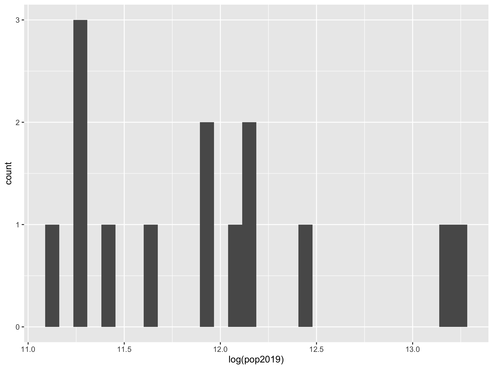

Above is a histogram representing population distribution of Jamaica's 14 Parishes (adm2).

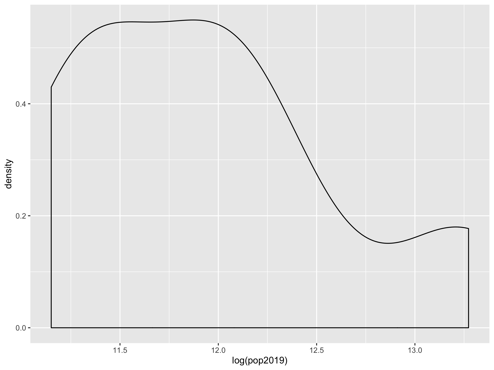

Density plot based on the log population data of Jamaica's 14 Parishes

Histogram of population distribution combined with probability density function.

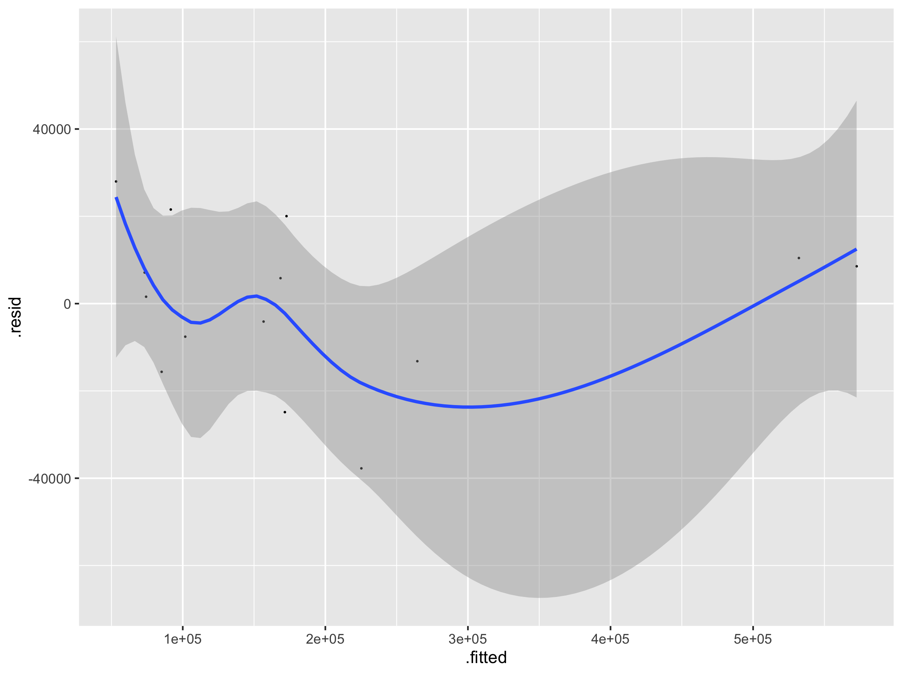

Residual model with regression line and confidence interval representing the correlation of night time lights, urban cover, and bare cover with Jamaica's population distribution.

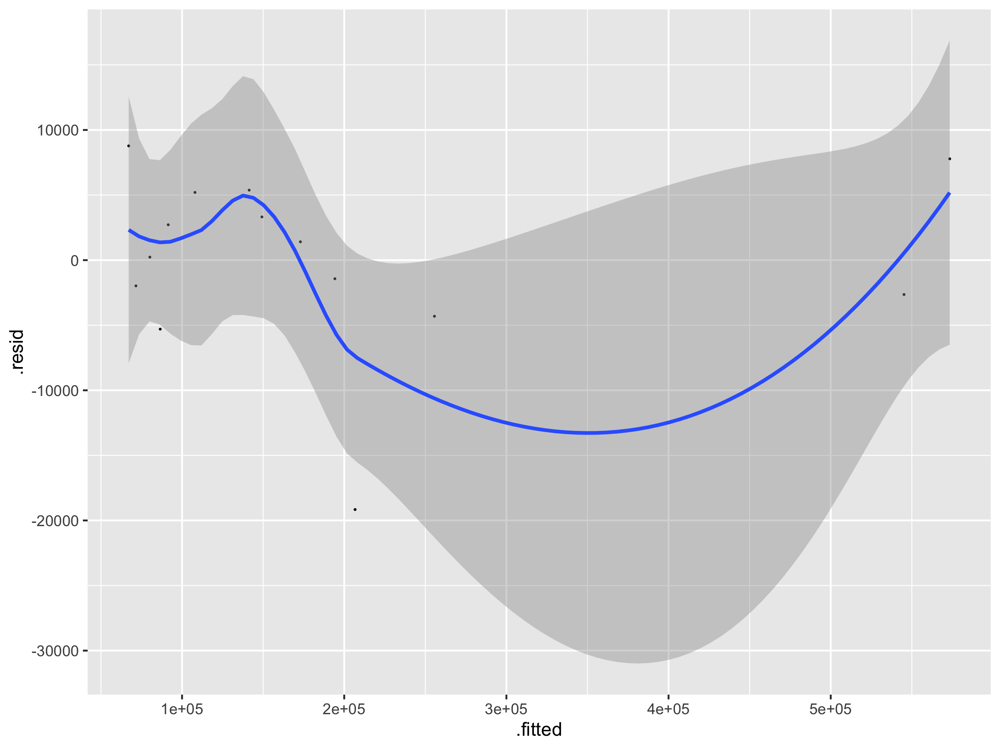

Residual model with regression line and confidence interval representing the correlation of all variables with Jamaica's population distribution.

## Part 2

### Jamaica - adm1

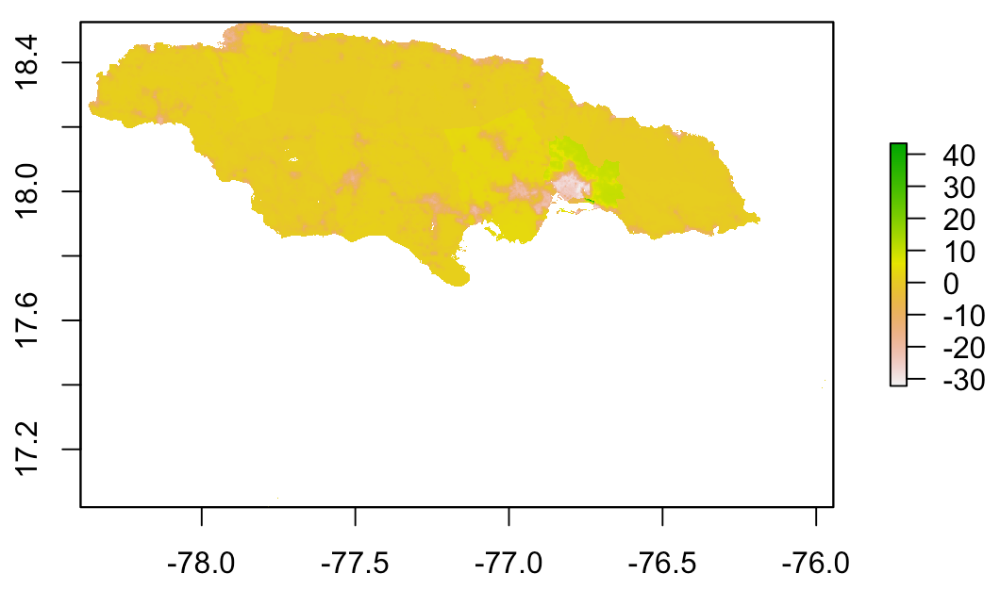
The above plot shows the difference (error) of predicted value from the worldpop raster in Jamaica. The error appears to be relatively consistent - slightly above 0 (overestimation) - throughout most of Jamiaca, though in the Saint Catherine/Saint Andrew/ Kingston area, the error dips down to -30. This represents a large underestimation, which makes sense because this is the most highly and densly populated area of Jamaica.

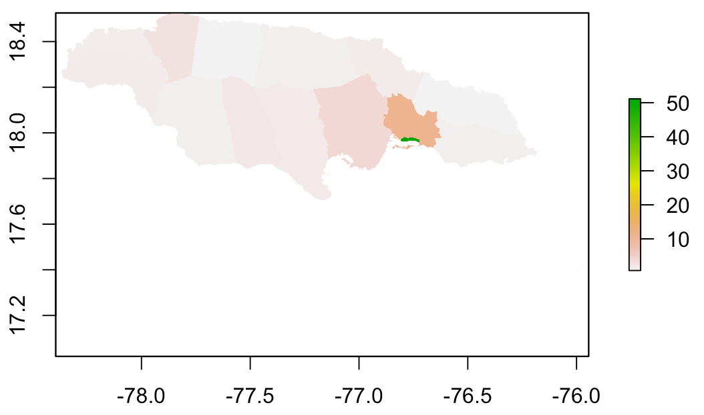
This plot shows the actual population values of Jamaica from the worldpop site. If you compare this plot to the previous one, you will see that the areas of high population are more likely to be underestimated, and the areas of low population are more likely to be overestimated.

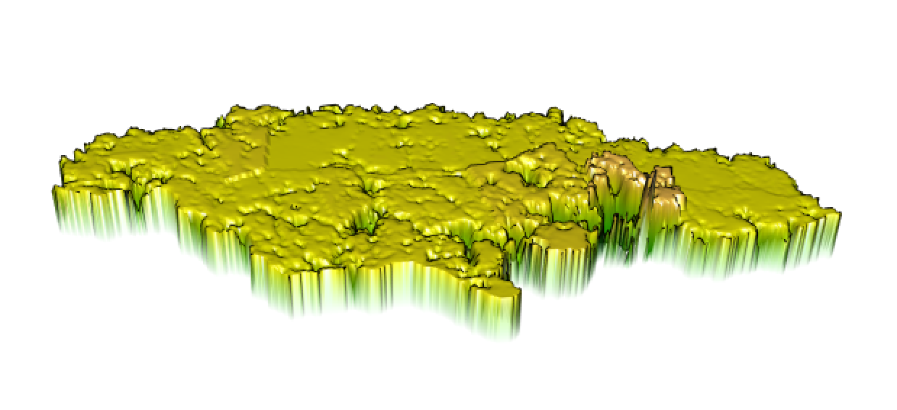

This 3D plot represents the variation exhibited in the predicted values. 

This plot is a mapview that also reprsents the error of the predicted values compared to the worldpop raster. As you can see, population values were underestimated near Kingston, the capital, and generally overestimated throughout the rest of the country.

### Saint Catherine - adm2

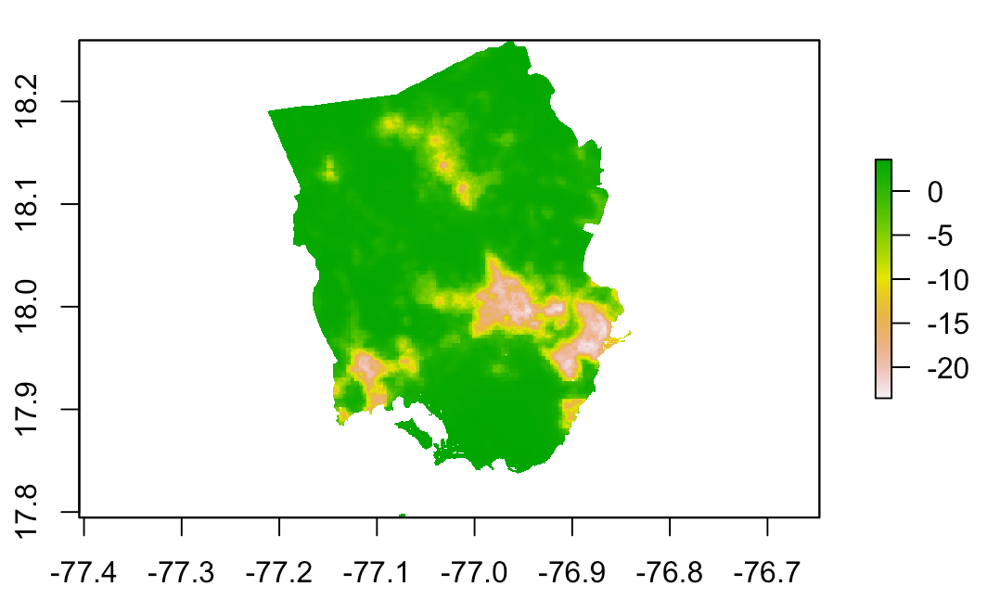
The above plot shows the difference (error) of predicted values from the worldpop raster in the Jamaican provice Saint Catherine. The areas of overestimation appear in spots towards the south east and south west, which makes sense as that is where the largest cities are located.

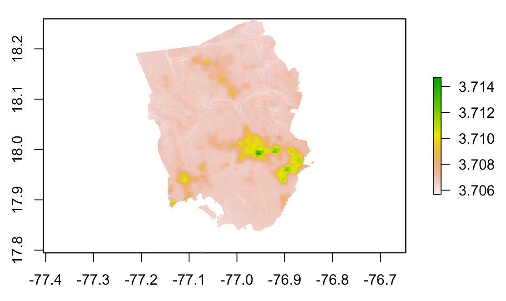
This plot shows the actual population values of Saint Catherine from the worldpop site. If you compare this plot to the previous one, you will see that the areas of high population are more likely to be underestimated, and the areas of low population are more likely to be overestimated.

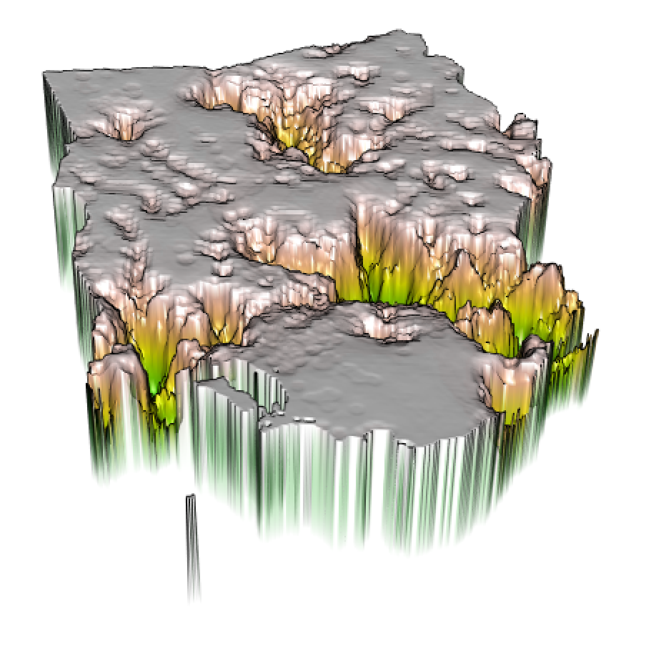

This 3D plot represents the variation exhibited in the predicted values. 

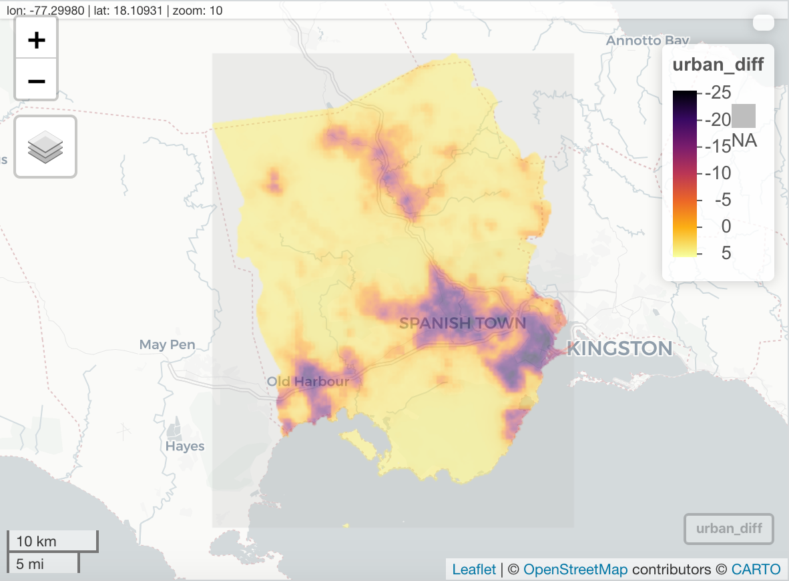
This plot is a mapview that also reprsents the error of the predicted values compared to the worldpop raster. The model overpredicted in areas of high population and under predicted in areas of low population. It's interesting to note that the underprediction error seems to generally be much larger than the overprediction error.
