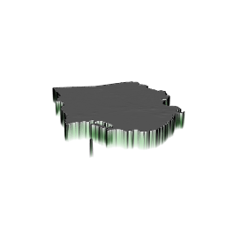

# Project 2: Jamaica

Henry Buron

## Part 1

Histogram representing population distribution of Jamaica's 14 Parishes.

Density plot.

Histogram of population distribution combined with probability density function.

Residual model with regression line and confidence interval representing the correlation of night time lights, urban cover, and bare cover with Jamaica's population distribution.

Residual model with regression line and confidence interval representing the correlation of all variables with Jamaica's population distribution.

## Part 2

### Jamaica - adm1

### Saint Catherine - adm2

