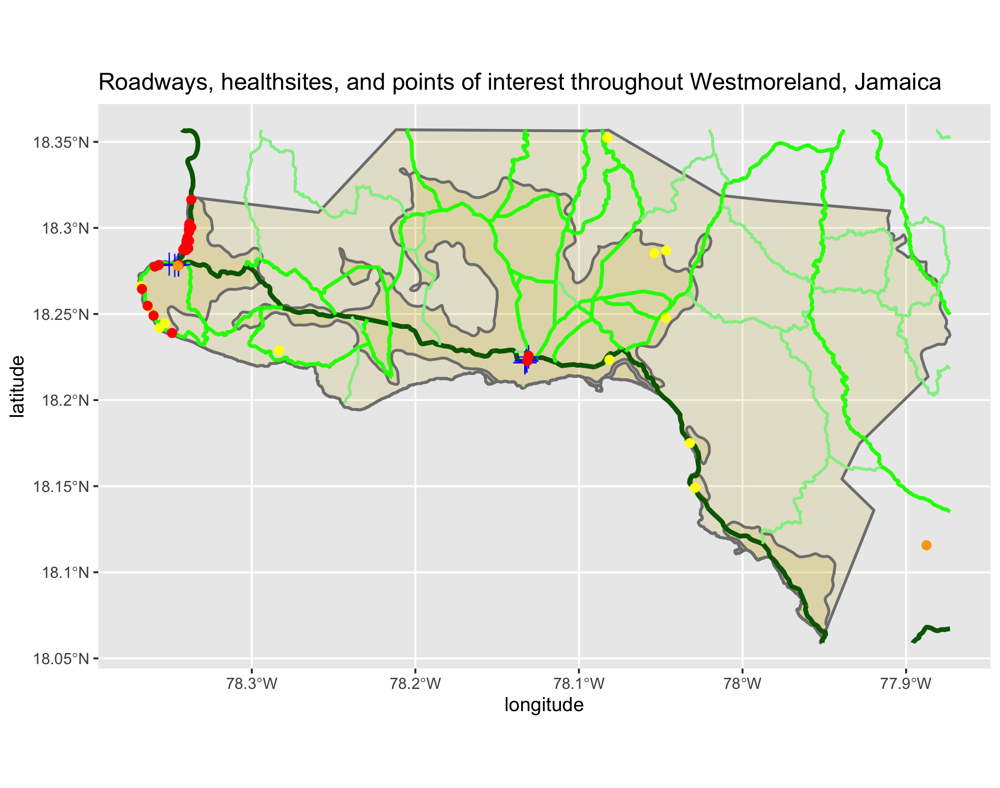

# Project 3 - Jamaica

Henry Buron

## Part 1 - Westmoreland, Jamaica

### Description of human settlement and urban areas.

The above plot represents the population per grid cell in Westmoreland, Jamaica. Westmoreland's total population is just under 145,000 people.

On this plot, each person in Westmoreland has been estimated and probalistically distributed. This means that there are about 145,000 points.

This plot represents the probability of the population density at each pixel.

This plot is the same as the one above, except it includes contour lines which separate the urban areas from the non-urban areas.

This plot shows the buffered lines on top of the population per grid cell plot. Buffered lines were created to fuse the contoured lines with the administrative boundary.

This plot shows Westmoreland's urban areas in light blue.

Unfortunately, I was not able to generate the population/density points on this plot (several of the commands kept producing errors that I could not figure out). However, as you will see below, I was able to plot several types of data points that I believe are positively correlated with population density.

## Part 2 - Westmoreland, Jamaica

### Transportation and health care services

On this plot, you will see Westmoreland's urban areas, roads, and health sites. As before, the urban areas are represented in light blue. There are several types of roads - main roads are dark green, secondary roads are green, and tertiary roads are light green. And finally, health sites are represented by the blue crosses. 

As I mentioned before, I was not able to generate the populatino/density points. So, I have found data that I believe is correlated with high population density. For example, on this plot, you will see three colors of points - yellow, orange, and red. Yellow represents a tourist attraction, orange is a place of worship, and red is a restaurant. These are all things likely placed in areas with a relatively high density of people. I believe this is supported by the plot - almost all of the points are located alongside a primary road, and many of those that are not are along the coast - an area of high traffic.

