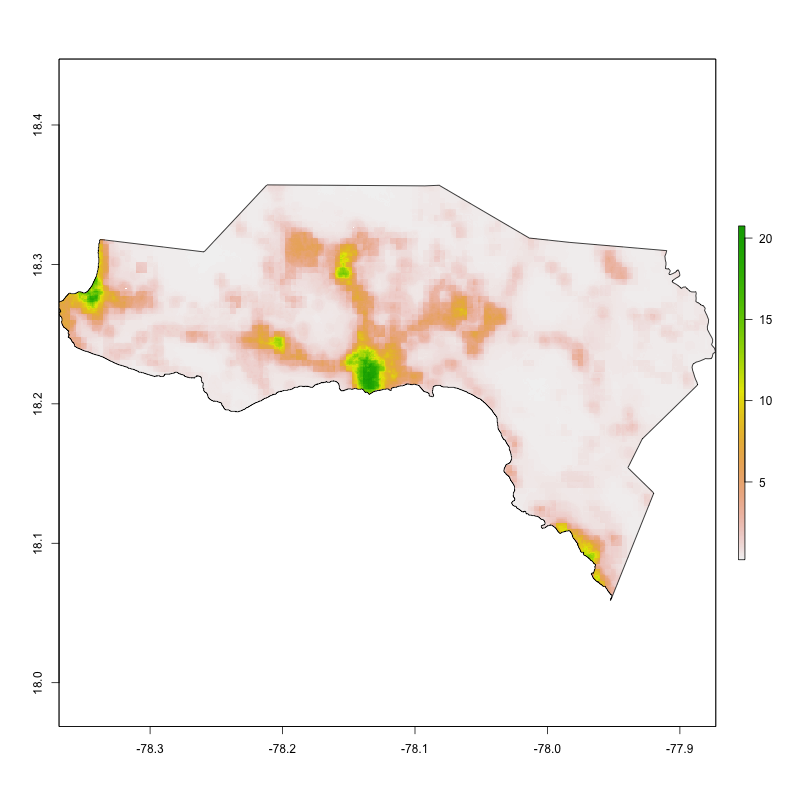
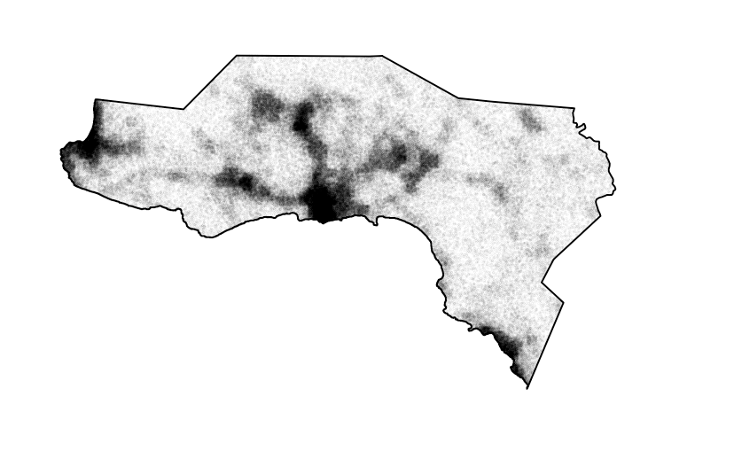
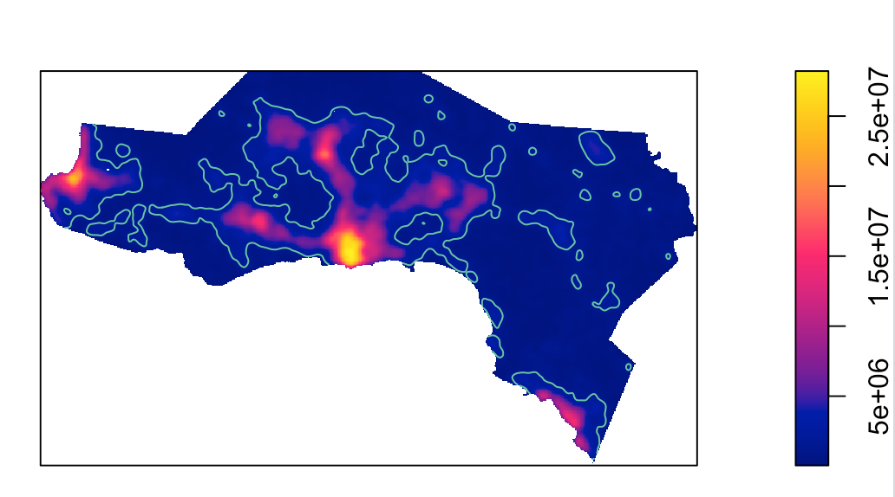

# Project 3 - Jamaica

Henry Buron

## Part 1 - Westmoreland, Jamaica

### Description of human settlement and urban areas.

The above plot represents the population per grid cell in Westmoreland, Jamaica. Westmoreland's total population is just under 145,000 people.

On this plot, each person in Westmoreland has been estimated and probalistically distributed. This means that there are just under 145,000 points.

This plot represents the probability of the population density at each pixel.

This plot is the same as the one above, except it includes contour lines which separate the urban areas from the non-urban areas.

This plot shows the buffered lines on top of the population per grid cell plot. Buffered lines were created to fuse the contoured lines with the administrative boundary.

This plot shows Westmoreland's urban areas in the darker tan.

Unfortunately, I was not able to generate the population/density points on this plot (several of the commands kept producing errors that I could not figure out). However, as you will see below, I was able to plot several types of data points that I believe are positively correlated with population density.

## Part 2 - Westmoreland, Jamaica

### Transportation and health care services

On this plot, you will see Westmoreland's urban areas, roads, and health sites. As before, the urban areas are represented by the slightly darker tan color. There are several types of roads - main roads are dark green, secondary roads are green, and tertiary roads are light green. And finally, health sites are represented by the blue crosses. 

As I mentioned before, I was not able to generate the populatino/density points. So, I found and downloaded more data from HDX that I believe is correlated with high population density. For example, on this plot, you will see three colors of points - yellow, orange, and red. Yellow represents a tourist attraction, orange is a place of worship, and red is a restaurant. These are all things likely placed in areas with a relatively high density of people. I believe this is supported by the plot - almost all of the points are located alongside a primary road, and many of those that are not are along the coast - an area of high traffic.

From this plot, we can see that the most highly populated and dense areas of Westemoreland seem to be slightly below the middle of the plot and on the western border. It is no coincidence that the main roads go directly through these areas. In addition, this makes sense as the center is the capital, Savannah la mar, and on the west is Nigel Point, Westmoreland's most popular tourist destination. It is also worth noting that the entire sourthern and western border is coastline, likely filled with beaches and tourist attractions that draw many people.

## Questions

1. The total population of Westmoreland, Jamaica is just under 145,000 people, and there are seven distinctly defined urban areas.

2. If you were to calculate the total population of all the urban areas, you would find that almost all of the population comes from two of them: the large one in the center, which is where Savannah la mar, the capital is located, and the one to the west, which is where Nigel Point, the main tourist destination is located.

3. In general, the roadways almost mirror the spatial distribution of human settlements and urban areas. The most populus areas, the capital and Nigel Point, have direct access to the primary road. I would estimate that the only people who experience difficulty in regards to transportation are those who are in the most remote areas possible, though luckily this is only a small percentage of the total population.

4. There are several types of health care facilities in Westmoreland, including pharmacies, doctors offices, dentists, and clinics. However, these facilities seem to only be located in the capital and Nigel Point. While these are likely the best spots for them to be located if there are only going to be a few health care facilities, it leaves much of the Parish relatively isolated. Luckily, the road system extends over almost the entire Parish, but it still leaves much to be desired, especially when considering that most of the urban areas do not have a major health site within their immediate borders.

