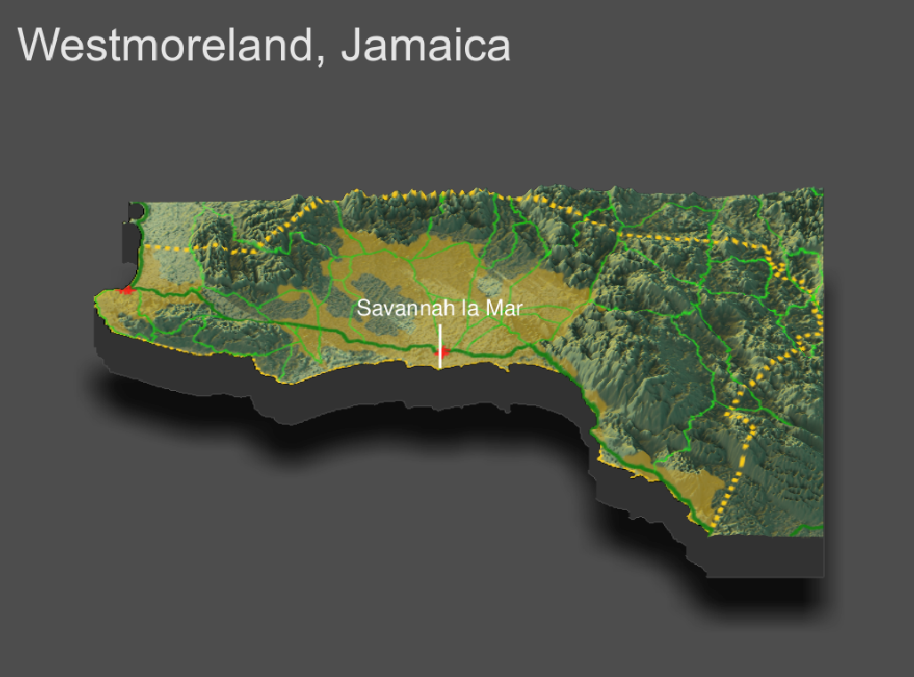

# Project 4 - Westmoreland, Jamaica

Henry Buron

## Topography

This is a three-dimensional topographic plot that describes urban areas, roadways, and health care facilities in Westmoreland, Jamaica's westernmost parish. The dashed yellow line represents the parish borders, the yellow areas are the urban areas, the green lines represent primary, secondary, and tertiary roads, and the red crosses represent health care facilities.

#### How has topography appeared to have impacted the development of urban areas?

#### How has topography appeared to have impacted the development of transportation facilities?

#### How has topography appeared to have impacted the location of health care facilities?

#### Has producing your three-dimentional map resulted in an interpretation that is different from your previous analysis?

Yes, rather than simply following the coast, it is clear that they follow...
