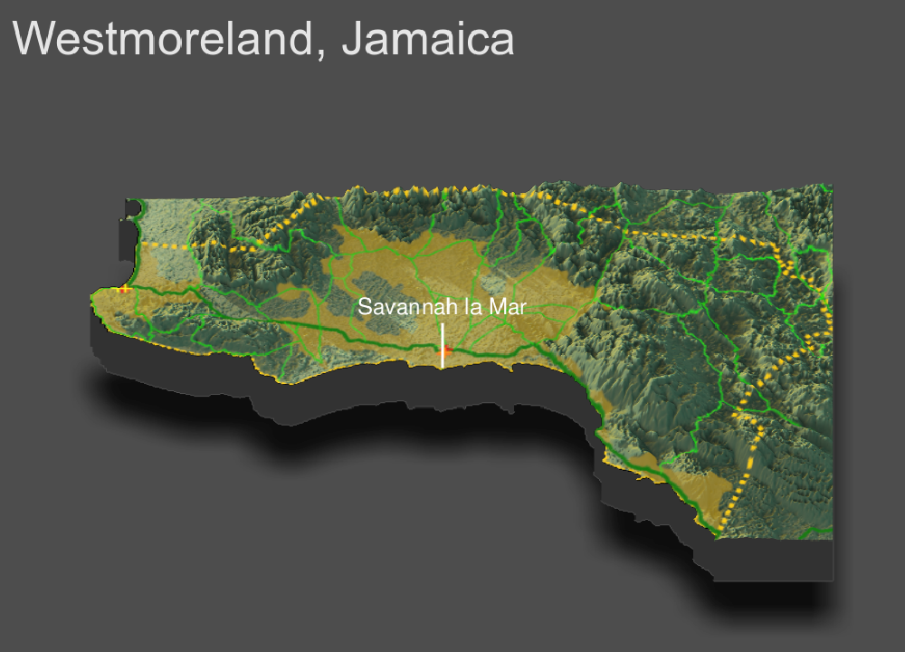

# Project 4 - Westmoreland, Jamaica

Henry Buron

## Topography

This is a three-dimensional topographic plot that describes urban areas, roadways, and health care facilities in Westmoreland, Jamaica's westernmost parish. The dashed yellow line represents the parish borders, the gold shaded areas are the urban areas, the green lines represent primary, secondary, and tertiary roads, and the red, orange, and yellow crosses represent pharmacies, clinics, and dentists, respectively.

#### How has topography appeared to have impacted the development of urban areas?

Topography has had a very large impact on the location and development of the urban areas. Much of Westmoreland is mountainous, yet the urban areas are almost each completely in the flatter regions. This is likely due to the simple fact that it is easier to build when not on the side of a mountain. There are three main urban areas in Westmoreland, and it is interesting to note that the only one that has a relatively large portion of mountainous area (on the right), is also the least developed one. It is possible, and entirely probable, that it has a harder time attracting and keeping residents when they could easily move and live in a flatter region.

#### How has topography appeared to have impacted the development of transportation facilities?

Although the roads seem to cover almost the entirety of Westmoreland, I still believe topography has played a big role in their development. Notice that primary roads are represented by dark green, secondary by green, and tertiary by light green. The primary road is completely in the flatter area, the secondary roads are mostly in the flatter area, but the tertiary roads freely extend throughout the mountainous region. The flatter areas correspond to the urban areas, which means that they are likely much more travelled and have therefore been developed to a much greater extent. It does not make much sense to develop the roads circling around the mountains that are infrequently used.

#### How has topography appeared to have impacted the location of health care facilities?

By design, health care facilities are made and located to help the highest amount of people possible. So, because the urban areas in Westmoreland are located in the flatter regions of the parish, so are the health care facilities.

#### Has producing your three-dimentional map resulted in an interpretation that is different from your previous analysis?

Yes, it has. Previously, when I had only produced the two-dimensional map with the locations of urban areas, roadways, and health care facilities, I reasoned that the location of the urban areas was due to the coast line (the whole southern and western border is coastline), however it is now clear that their locatoin is due to topography - specifically, places with a relatively smooth terrain. 
